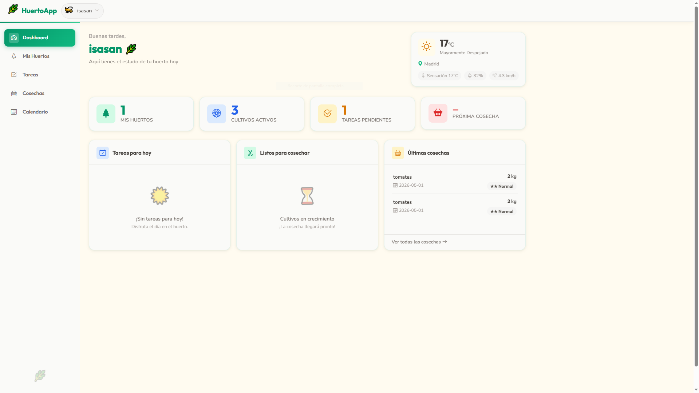
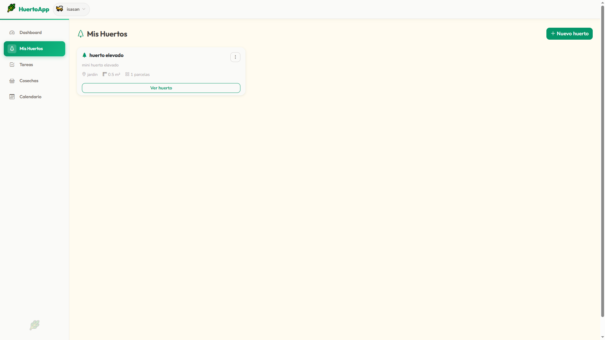
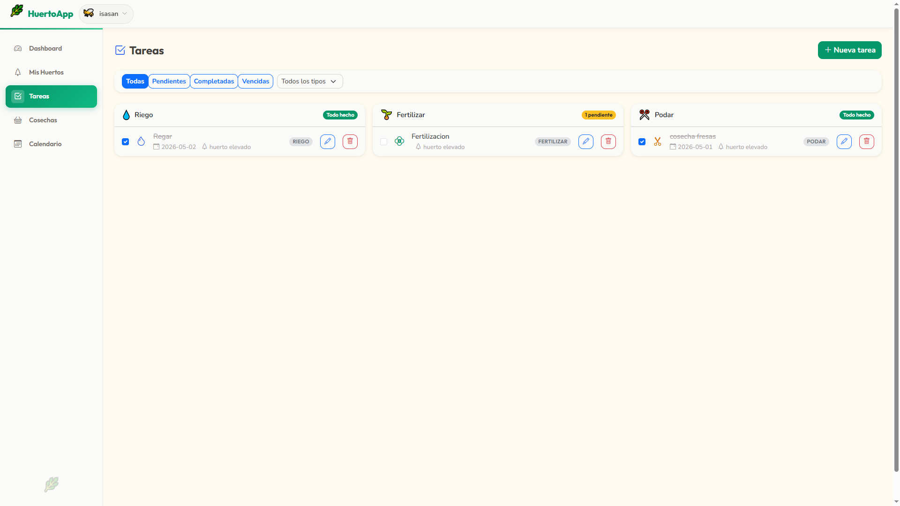
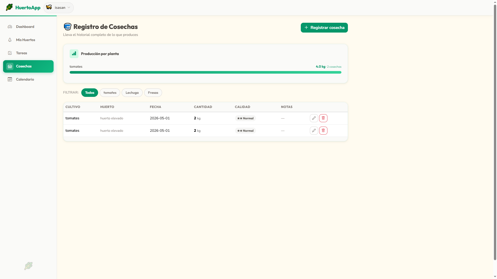
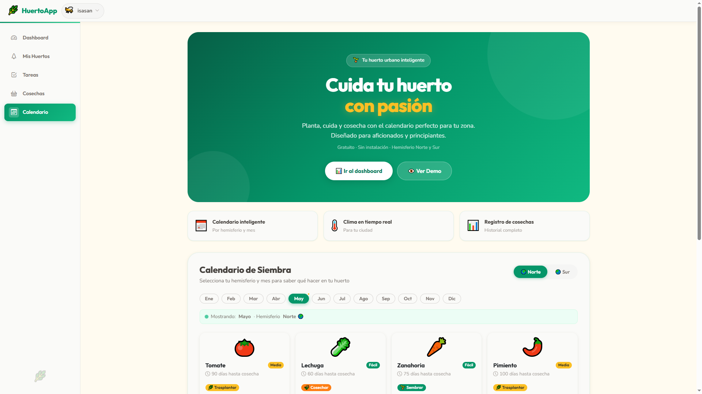
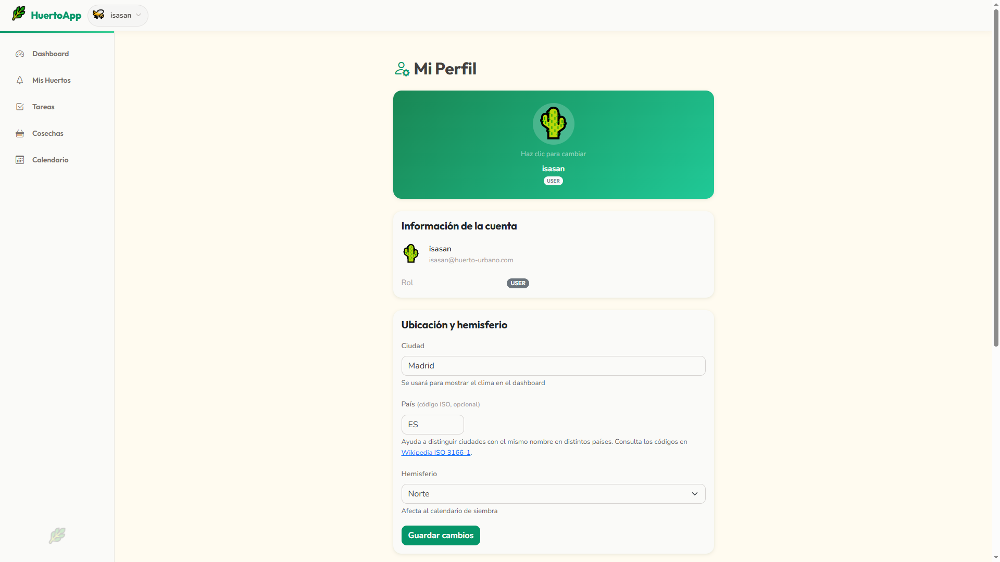

# 🌱 HuertoApp


Aplicación fullstack para gestionar huertos urbanos domésticos. Permite controlar parcelas, cultivos, tareas de mantenimiento, registros de cosecha y consultar el clima en tiempo real.

> **Proyecto de portafolio** — demuestra una arquitectura REST completa con Spring Boot 3 + Vue 3.

---

## Capturas de pantalla

| Dashboard | Mis Huertos | Tareas |
|:---------:|:-----------:|:------:|
|  |  |  |

| Cosechas | Calendario de siembra | Perfil |
|:--------:|:---------------------:|:------:|
|  |  |  |

---

## Stack tecnológico

### Backend
| Tecnología | Versión | Uso |
|------------|---------|-----|
| Java | 17 | Lenguaje principal |
| Spring Boot | 3.x | Framework web |
| Spring Security | 6.x | Autenticación y autorización |
| Spring Data JPA | 3.x | Capa de persistencia |
| H2 Database | 2.x | Base de datos embebida |
| JWT (jjwt) | 0.11+ | Tokens de autenticación |
| Spring WebFlux WebClient | 3.x | Cliente HTTP reactivo (clima) |
| Lombok | — | Reducción de boilerplate |
| SpringDoc OpenAPI | 2.x | Documentación Swagger |

### Frontend
| Tecnología | Versión | Uso |
|------------|---------|-----|
| Vue | 3 | Framework UI (Composition API) |
| Vite | 5.x | Bundler y dev server |
| Pinia | 2.x | Gestión de estado |
| Vue Router | 4.x | Enrutamiento SPA |
| Axios | 1.x | Cliente HTTP |
| Bootstrap | 5.x | Estilos y componentes |
| Bootstrap Icons | 1.x | Iconografía |

---

## Requisitos previos

- **Java 17+** — [descargar](https://adoptium.net/)
- **Maven 3.8+** — incluido en la mayoría de IDEs, o instalar desde [maven.apache.org](https://maven.apache.org/)
- **Node.js 18+** y **npm 9+** — [descargar](https://nodejs.org/)

---

## Instalación y ejecución local

### 1. Clonar el repositorio

```bash
git clone https://github.com/isasan/app-huerto-urbano.git
cd app-huerto-urbano
```

### 2. Configurar el backend

```bash
cd backend
```

Revisa `src/main/resources/application.properties`. Los valores por defecto funcionan sin ningún cambio:

```properties
# JWT (24 h — cambiar en producción)
app.jwt.secret=huertoapp-secret-key-change-in-production-min-256-bits
app.jwt.expiration=86400000

# Clima (Open-Meteo — sin API key)
app.weather.base-url=https://api.open-meteo.com/v1
app.weather.geocoding-url=https://geocoding-api.open-meteo.com/v1

# H2
spring.datasource.url=jdbc:h2:file:./data/huertoapp
spring.h2.console.enabled=true
```

### 3. Arrancar el backend

```bash
# Desde la carpeta backend/
mvn spring-boot:run
```

El servidor arranca en `http://localhost:8080`.

### 4. Instalar dependencias del frontend

```bash
cd ../frontend
npm install
```

### 5. Arrancar el frontend

```bash
# Desde la carpeta frontend/
npm run dev
```

El dev server arranca en `http://localhost:5173`.  
El proxy de Vite reenvía automáticamente `/api/*` → `http://localhost:8080`.

### 6. Abrir la aplicación

Navega a `http://localhost:5173` y regístrate con cualquier usuario.

---

## API de clima — Open-Meteo

HuertoApp usa **Open-Meteo**, que es completamente **gratuito y sin API key**. No necesitas registrarte en ningún servicio para que el widget de clima funcione.

El widget de clima del dashboard se activa automáticamente si configuras tu ciudad en **Mi Perfil → Ubicación**.

---

## Herramientas de desarrollo

### H2 Console

Accesible en `http://localhost:8080/h2-console` con el servidor arrancado.

| Campo | Valor |
|-------|-------|
| JDBC URL | `jdbc:h2:file:./data/huertoapp` |
| Usuario | `sa` |
| Contraseña | *(vacía)* |

### Swagger UI

Documentación interactiva de la API REST en `http://localhost:8080/swagger-ui.html`.

Usa el botón **Authorize** para pegar tu Bearer token y probar endpoints protegidos.

---

## Estructura del proyecto

```
huertoapp/
├── backend/
│   └── src/main/java/com/huertoapp/
│       ├── model/           # Entidades JPA: User, Garden, Plot, Crop, Task, HarvestLog
│       ├── repository/      # Spring Data JPA repositories
│       ├── service/         # Lógica de negocio + control de propiedad
│       ├── controller/      # REST controllers (@RestController)
│       ├── dto/
│       │   ├── request/     # DTOs de entrada
│       │   └── response/    # DTOs de salida
│       ├── security/        # JWT provider + filter + UserDetailsService
│       ├── config/          # SecurityConfig, OpenApiConfig
│       ├── exception/       # GlobalExceptionHandler
│       └── data/            # SeedingCalendarData (datos estáticos en memoria)
└── frontend/
    └── src/
        ├── components/
        │   ├── layout/      # AppNavbar, AppSidebar
        │   ├── gardens/     # GardenCard, GardenForm
        │   ├── crops/       # CropList, CropForm
        │   ├── tasks/       # TaskBoard, TaskItem
        │   ├── calendar/    # SeedingCalendar, PlantCard
        │   ├── weather/     # WeatherWidget
        │   └── GlobalToast.vue
        ├── composables/     # useToast
        ├── views/           # Una vista por ruta
        ├── services/        # Clientes Axios por entidad
        ├── stores/          # Pinia: auth, garden, weather
        └── router/          # Vue Router con guards
```

---

## Funcionalidades implementadas

- **Autenticación** — registro, login y logout con JWT; sesión persistida en localStorage
- **Huertos** — CRUD completo; organización en parcelas con tipo de suelo
- **Cultivos** — seguimiento por parcela con estado, fechas de siembra y cosecha esperada
- **Tareas** — tablero por tipo (Riego, Fertilizar, Podar, Tratar, Otro); filtros y ordenación por fecha
- **Cosechas** — historial con cantidad, unidad y calificación de calidad; estadísticas por planta
- **Clima** — widget con temperatura, humedad y viento vía Open-Meteo; caché de 30 min
- **Calendario de siembra** — datos para 12 plantas × 2 hemisferios sin base de datos
- **Dashboard** — resumen en tiempo real con tareas del día, cultivos listos y últimas cosechas
- **Panel de administración** — estadísticas globales y gestión de roles de usuario
- **Responsive** — diseño adaptable a móvil desde 320px con menú hamburguesa

---

## Notas técnicas

### Por qué H2 en lugar de PostgreSQL

H2 es una base de datos embebida que arranca automáticamente con Spring Boot sin ninguna instalación externa. Es ideal para MVP y demos locales.

**Para migrar a PostgreSQL:**

1. Añadir dependencia en `pom.xml`:
   ```xml
   <dependency>
     <groupId>org.postgresql</groupId>
     <artifactId>postgresql</artifactId>
   </dependency>
   ```
2. Actualizar `application.properties`:
   ```properties
   spring.datasource.url=jdbc:postgresql://localhost:5432/huertoapp
   spring.datasource.username=postgres
   spring.datasource.password=tu_password
   spring.datasource.driver-class-name=org.postgresql.Driver
   spring.jpa.database-platform=org.hibernate.dialect.PostgreSQLDialect
   spring.h2.console.enabled=false
   ```
3. Eliminar la dependencia H2 del `pom.xml`.

El esquema se migra automáticamente gracias a `spring.jpa.hibernate.ddl-auto=update`.

---

### Por qué JWT sin refresh token

El diseño actual emite un único token con expiración de 24 horas. Esto simplifica la implementación al no requerir una tabla de tokens válidos ni lógica de rotación.

**Para añadir refresh tokens:**

1. Crear entidad `RefreshToken` con `token`, `userId` y `expiresAt`.
2. Al hacer login, emitir un `accessToken` (15 min) y un `refreshToken` (7 días) en `HttpOnly cookie`.
3. Añadir endpoint `POST /api/auth/refresh` que valide el refresh token y emita un nuevo access token.
4. En el interceptor de Axios, capturar 401 y llamar al endpoint de refresh antes de reintentar.

---

### Límites del API de clima y la caché implementada

Open-Meteo no tiene límites de peticiones documentados para uso razonable, pero para evitar peticiones innecesarias se implementó una **caché en memoria** (`ConcurrentHashMap`) con TTL de **30 minutos**, keyed por `ciudad_codigoPais`.

Esto significa que si 100 usuarios tienen configurada la misma ciudad, solo se hace una llamada al API cada 30 minutos. La caché vive en la JVM y se vacía al reiniciar el servidor.

Para producción se recomienda externalizar la caché con **Redis** usando `@Cacheable` de Spring Cache.

---

## Licencia

[MIT](LICENSE) — libre para uso, modificación y distribución.

<!-- CI workflow test -->
